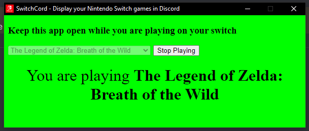
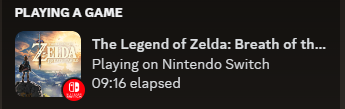

# switchcord
Simple electron app that allows you to display supported Nintendo Switch games in your discord status. It currently requires you to select the game from a dropdown, because I'd rather it just be simple.

Only supports a few titles that I am playing. Also yea the ui is pretty ugly, but it works.

  